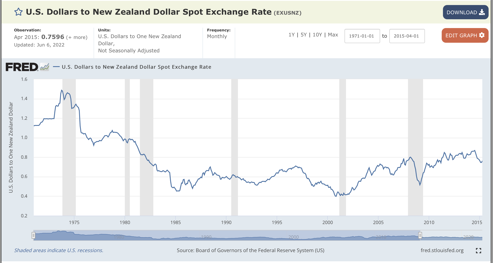

```{r setup, echo=FALSE, message=FALSE, include=FALSE}
library(latex2exp)
library(tidyverse)
library(ggplot2)
library(patchwork)
library(data.table)

library(magrittr)
library(patchwork)

library(tsibble)
library(fpp3)
library(feasts)
library(fable)
library(astsa)

library(lubridate)
library(lmtest)

berkeley_blue   <- '#003262'
california_gold <- '#FDB515'

options(htmltools.dir.version = FALSE)
options(digits = 4)
knitr::opts_chunk$set(echo = TRUE, dpi = 300, fig.height = 3)


theme_set(theme_minimal())
```

class: inverse, center, middle 

# Autoregressive Models, Part III: Expression in Lag Operators 

---
# Backshift Operators: An Introduction
## Backshift Operator, Part I 

A very useful concept is the backshift operator because it (and its associated characteristic polynomials) can be used to study the properties of $AR(p)$ models, and $ARIMA(p)$ models in general. 

$$\phi(B) = 1 - \phi_{1}B - \phi_{2}B^{2} - \cdots - \phi_{p-1}B^{p-1} - \phi_{p}B^{p}$$

Using the backshift operator, the AR model can be re-written as: 

$$\phi(B)x_{t} = \omega_{t}$$ 

The equation $\phi(B) = 0$ is called a *characteristic equation*, and it provides a tool to check if a process is stationary. 

---
# Backshift Operators: An Introduction
## Is a process stationary? 

If the absolute value of roots of the characteristic equation *all* exceed $1$, then the process $x_{t}$ is *stationary*. 

---
# Examples of Using the Backshift Operator
## Example 1

- Suppose that there is a random walk model $x_{t} = x_{t_1} + \omega_{t}$. 
- This has the characteristic equation $\phi = 1$ and $\theta = 1 - B$ with root $B=1$. 
- **Therefore**, this is a non-stationary process because the root does not exceed $1$.

---
# Examples of Using the Backshift Operator 
## Example 2 

- Suppose that there is an $AR(1)$ model $x_{t} = \frac{1}{2}x_{t-1} + \omega_{t}$. 
- This has the characteristic equation $1 - \frac{1}{2}B = 0$, and the root of $B=2$ which is greater than $1$. 
- **Therefore**, this $AR(1)$ model is stationary. 

---
# Examples of Using the Backshift Operator 
## Example 3 

- Suppose that there is an $AR(2)$ model $x_{t} = x_{t-1} - \frac{1}{4}x_{t-2} + \omega_{t}.$ 
- Expressed using the backshift operator, 

$$\begin{aligned} 
\omega_{t} &= \frac{1}{4}(B^{2} - 4^B + 4)x_{t} \\ 
  &= \frac{1}{4}(B-2)^{2}x_{t}
\end{aligned}$$

- The corresponding characteristic equation is $\phi(B) = \frac{1}{4}(B-2)^{2} = 0$, so the root is $B = 2$ which is greater than $1$. 
- **Therefore**, this $AR(2)$ model is stationary. 

---
# Examples of Using the Backshift Operator 
## Example 4

- Suppose that there is an $AR(2)$ model $x_{t} = \frac{1}{2}x_{t-1} + \frac{1}{2}x_{t-2} + \omega_{t}$. 
- Expressed using the backshift operator, $-\frac{1}{2}(B^{2} + B - 2)x_{t} = \omega_{t}$. 
- The corresponding polynomial $\phi(B) = -\frac{1}{2}(B-1)(B+2)$ has roots $B = \{1, -2\}$. 
- **Therefore**, with the unit root $B=1$ this $AR(2)$ model is *non-stationary*.

---
class: inverse, center, middle 
# Intuition of the Properties of the General AR(p) Models

---
# Autoregressive Models in Lag Operators 

For a (weakly) stationary $AR(p)$ model, its lag operator presentation is: 

$$\Phi(L)x_{t} = \alpha + \epsilon_{t},$$

where: 

$$\Phi(L) = 1 - \phi L - \dots - \phi_{p}L^{p}$$

- Recall that the stationarity condition for the $AR(p)$ model is that the roots of the characteristic polynomial $Phi(z)$ all lie **outside** the unit circle. 
- Equivalently, the inverse of the roots of $z^{p} - \phi_{1}z^{p-1} - \dots - \phi_{p}$ all lie **inside** the unit circle. 

The expectation of this model is 

$$E(x_{t}) = \frac{\alpha}{1 - \phi_{1} - \dots - \phi_{p}}.$$ 

The autocovariance function of the general $AR(p)$ model that be derived using the *Yule-Walker* equations. 

---
# Key Properties of the General AR(p) Model, Part I 
The general properties of an $AR(1)$ model carry through to an $AR(p)$ model. 

1. **Stationarity Condition**: An $AR(p)$ process is covariance stationary if and only if the **inverse** of all roots of the autoregressive lag operator polynomial $\Phi(B)$ are *inside* the unit circle. 
2. **ACF**: The autocorrelation function for the $AR(p)$ process decays gradually with displacement. 
3. **PACF**: The partial autocorrelation function has a sharp cut-off at **displacement p**. 

---
# Key Properties of the General AR(p) Model, Part II
**However** there are differences between the genearal $AR(p)$ models and the $AR(1)$ models: 

1. Models with higher autoregressive order allow for richer dynamics. As a result, the autocorrelation function displays a wider "variety" of patterns. 
  - It might display damped, monotonic decays as in the $AR(1)$ case with a positive coefficient; or, 
  - It might have a damped oscillation that $AR(1)$ processes cannot have unless their coefficient are negative. 
2. The richer patterns of the *ACF* from the higher-order autoregressive models can mimic a wider range of cyclical patterns. 

---
class: inverse, center, middle 
# Simulation of AR(2) Models 

---
# Use An AR(2) Model to Illustrate Properties, Part I 

Consider an $AR(2)$ model that has the following specification: 

$$y_{t} = 1.5 y_{t-1} - 0.9 y_{t-2} + \epsilon_{t}$$ 

The corresponding lag operator polynomial is: 

$$1 - 1.5B - 0.9 B^{2}$$

The roots of this polynomial can found in R using the `polyroot` function, and are the following two complex conjugate roots: 

```{r use polyroot, echo = TRUE}
lag_operator <- c(1, -1.5, 0.9)
polyroot(lag_operator)
```

---
# Use An AR(2) Model to Illustrate Properties, Part I 

The absolute values of these roots are: 

```{r absolute value of roots}
abs(polyroot(lag_operator))
```

And, the inverse of these absolute roots are: 

```{r inverse of polyroot}
1 / abs(polyroot(lag_operator))
```

Both of these roots are *close* to $1$, but they are inside the unit circle, therefor the process is **covariance stationary**. 

---
# Autocorrelation of an AR(2) process
The autocorrelation function of an $AR(2)$ process is: 

$$\begin{aligned}
  \rho(0) &= 1 \\ 
  \rho(1) &= \frac{\phi_{1}}{1-\phi_{2}} \\ 
  \rho(2) &= \phi_{1}\rho(\tau - 1) + \phi_{2}\rho(\tau - 2) & \tau = 2, 3, \dots
\end{aligned}$$

---
# Use An AR(2) Model to Illustrate the Properties, Part II

- Because the roots are complex, the autocorrelation function oscillates 
- Because the root are close to one, the autocorrelation function oscillates slowly. 


```{r, echo=FALSE}
sim_data <- arima.sim(n=1000, list(ar = c(1.5, -0.9))) %>% 
  as_tsibble()
```

```{r, echo=FALSE}
sim_data %>% 
  ACF(y=value) %>% 
  autoplot()
```

---
# # Use An AR(2) Model to Illustrate the Properties, Part III

This histogram looks reasonably symmetric: 

```{r, echo = FALSE, message=FALSE}
sim_data %>% 
  ggplot() + 
  aes(x=value) + 
  geom_histogram() + 
  labs(
    title = 'Simulation of AR(ar1=1.5, ar2=-0.9)'
  )
```

---
# Use An AR(2) Model to Illustrate the Properties, Part IV

- The time series plot shows that the series displays fluctuations 
- The magnitude of these fluctuations change over time. 

```{r, echo = FALSE}
sim_data %>% 
  autoplot(value) + 
  labs(title = 'Simulation of AR(ar1=1.5, ar2=-0.9)')
```

---
# Use An AR(2) Model to Illustrate the Properties, Part V 

- As in the $AR(1)$ model where the PACF has a sharp cut-off at **displacement 1** , the PACF of the $AR(2)$ process has a strong cut-off at **displacement 2**. 

```{r, echo = FALSE}
sim_data %>% 
  PACF(y=value) %>% 
  autoplot()
```

---
class: inverse, middle, center
# Model Estimation and Model Selection 

---
# Estimation, Example 1: AR(1), Part I

- Let's apply an $AR$ model to the series we simulated using an $AR(1)$ process of the following specification: 

$$x_{t} - \mu = 0.7(x_{t-1} - \mu) + \omega_{t},$$

where $\mu$ is the mean of the series. 

```{r}
x <- arima.sim(
  n=1000, 
  model = list(ar=0.7, ma=0)) %>% 
  as_tsibble(index = index)
```

```{r, echo=FALSE}
glimpse(x)
summary(x)
```

---
# Estimation, Example 1: AR(1), Part II

- Examine the simulated series by visualizing its distribution (using a histogram), its dynamics (using the time series plot), and its dependence structure using ACF and PACF graphs. 

```{r, echo=FALSE, message=FALSE}
plot_histogram <- x %>% 
  ggplot(aes(x=value)) + 
  geom_histogram()

plot_timeseries <- x %>% 
  autoplot(.vars = value)

plot_acf <- x %>% 
  ACF(y=value) %>% 
  autoplot()

plot_pacf <- x %>% 
  PACF(y=value) %>% 
  autoplot()

(plot_histogram | plot_timeseries) / 
  (plot_acf | plot_pacf) +
  plot_annotation(title = 'Diagnostic Plots of AR(1) Series')
```

---
# Estimation, Example 1: AR(1), Part III

- This estimation uses the `ar()` function which estimates a $AR$ model of the following form: 

$$x_{t}-\mu = \alpha_{1}(x_{t-1} - \mu) + \dots + \alpha_{p}(x_{t-p} - \mu) + \omega_{t}$$. 

    ar(x, aic = TRUE, order.max = NULL,
       method = c("yule-walker", "burg", "ols", "mle", "yw"),
       na.action, series, ...)
       
- By default, `ar()` uses $AIC$ as the selection criteria 
- Recall that $AIC$ is a goodness of fit measure that penalizes the number of parameters. (We will discuss this on the next slide). 

---
# Estimation, Example 1: AR(1), Part IV

```{r estimate ar model, message=FALSE, warning=FALSE}
ar_model <- x %$%
  ar(value, method = 'mle')
```

From the model that is fitted, there are several objects of interest that can be accessed. We will not print all of them here, but the *structure* can be viewed using the `str` call, which will provide the names of the list objects that might be of interest. 

```{r}
# str(ar_model)
ar_model$order
ar_model$ar
```

---
# Estimation, Example 1: AR(1), Part V 

```{r}
sqrt(ar_model$asy.var.coef)
ar_model$aic
```

- Note that the AIC that are shown in the `ar_model$aic` are all displayed, but they are shown as a **difference** between the model with the *lowest* $AIC$ and the $AIC$ of the numbered model. 

---
# Estimation, Example 1: AR(1), Part VI

Notice that because we have produced an estimate of the `order` of the AR model, as well as the parameter estimate, **and** an estimate of the standard error of the model, is is possible to produce a confidence interval for this parameter estimate: 

```{r, warning=FALSE, message=FALSE}
critical_values <- qt(c(0.025, 0.975), df = nrow(x))
se <- c(sqrt(ar_model$asy.var.coef)) # this c() is to convert the 
                                     # type to avoid a warning

ar_model$ar + (critical_values * se)
```

---
# Estimation, Example 1: AR(1), Part VII

Based on this *particular* sample path: 

- The estimated parameter estimate is `r ar_model$ar`. 
- The $95$ **% Confidence Interval** is `r paste0("(", round(ar_model$ar + critical_values[1] * se[1], 3), ", ", round(ar_model$ar + critical_values[2] * se[1], 3), ")")` 
- Taking care to interpret this frequentist confidence interval, we know that this estimation process would produce a CI that **actually does** contain the *unknown, true* order parameter $95$ out of $100$ times. 

---
class: inverse, center, middle 
# Model Diagnostics and Assumption Testing 

---
# Estimation 

Model assumption and diagnostic testing; 

1. $AR$ models that random components resembling that of white noise. 

> **Question to evaluate**: Do the estimated residuals look like the realizations generated by a white noice process? 

2. We are interested in $AR$ models. 

> **Question to evaluate**: Is our estimated $AR$ model stationary (at least statistically)? 

---
# Model Assumption Diagnosis and Testing 

Do the estimated residuals look like the realizations generated by a white noice process? 

```{r, echo = FALSE, message=FALSE, warning=FALSE}
ar_residuals <- ts(data = ar_model$resid) %>% 
  as_tsibble()
```

```{r, echo = FALSE, message=FALSE, warning=FALSE, fig.height=4}
data_ts_plot <- x %>% 
  autoplot(value) + 
  scale_x_continuous(name = NULL, labels = NULL) + 
  scale_y_continuous(name = NULL, labels = NULL) + 
  labs(title = 'Core Data Time Series Plot')

residual_ts_plot <- ar_residuals %>% 
  autoplot(value) + 
  scale_x_continuous(name = NULL, labels = NULL) + 
  scale_y_continuous(name = NULL, labels = NULL) + 
  labs(title = 'Residuals Time Series Plot')

residuals_acf <- ar_residuals %>% 
  ACF(y=value) %>% 
  autoplot() + 
  scale_x_continuous(name = NULL, labels = NULL) + 
  scale_y_continuous(name = NULL, labels = NULL) + 
  labs(title = 'Residuals ACF')

residuals_pacf <- ar_residuals %>% 
  PACF(y=value) %>% 
  autoplot() + 
  scale_x_continuous(name = NULL, labels = NULL) +
  scale_y_continuous(name = NULL, labels = NULL) + 
  labs(title = 'Residudals PACF')

residuals_hist <- ar_residuals %>% 
  ggplot(aes(x=value)) + 
  geom_histogram() + 
  scale_x_continuous(name = NULL, labels = NULL) +
  scale_y_continuous(name = NULL, labels = NULL) + 
  labs(title = 'Residuals Histogram')

residuals_qq <- ar_residuals %>% 
  ggplot(aes(sample=value)) + 
  stat_qq() + 
  scale_x_continuous(name = NULL, labels = NULL) +
  scale_y_continuous(name = NULL, labels = NULL) + 
  labs(title = 'Residuals QQ')

(data_ts_plot | residual_ts_plot) / 
  (residuals_acf | residuals_pacf) / 
  (residuals_hist | residuals_qq)
```

---
class: inverse, center, middle
# Example 2: Estimation, Model Selection, Model Diagnostics, and Assumption Testing 

---
# Example 2: The True Data Generating Process 

- Let's apply an $AR$ model to the more complicated series of data that we simulated in `sim_data`
- The *true* (the population model that our simulation is sampling from) modle that generated this data has the following *functional form*: 

$$y_{t} = 1.5 y_{t-1} - 0.9y_{t-2} + \epsilon_{t}$$ 

- Because we have already examined the series, proceed direction to estimation (without EDA this time)
- For this estimation, suspend reality and suppose that we do not have knowledge of the underlying **data generaeting process (DGP)** but based on the EDA that we've done, we decide to try using an $AR$ model. 

---
# Example 2: R commands 

- We will us the `ar` function to select the model with the lowest $AIC$. 
- Then, we will examine the `order`, `ar`, `aic`, and `asy.var.coef`.
- *NB: Because of stochastic errors, the run in the slides might be different when you run it than were shown in the lecture*.

```{r}
ar_sim <- ar(sim_data)
ar_sim$order
ar_sim$ar
ar_sim$aic[1:12]
```

---
# Example 2: Points to Note 

1. This `ar` call estiamted many different AR models, with orders from $1 - p$. It is possible to change the maximum order using the argument `order.max=`. 
2. The *best* model (in terms of smallest AIC) depends in some part on the sample. In the async, when Jeffrey runs this code, the $AR(5)$ is the best, even though the **true** DGP is an $AR(2)$. Is this an *error*? No, it is a the result of a sample.
3. The $AIC$ of some of these models is *huge* but several are within the "same ballpark" as the true DGP. 

---
# Example 2: Model Diagnostics 

Examine the reisduals: 

- Notice that the first several observations in the estimated residual serires are missing. This is because $p$ residuals are excluded from the best fitting, order $p$ model. 
- For this reason, the $ACF$ and $PACF$ are excluded from plots. 

---
# Example 2: Model Diagnostics 

Good news! The residuals look like white noise series. 

```{r, echo=FALSE}
sim_data_residuals <- ts(ar_sim$resid) %>% 
  as_tsibble()
```

```{r, echo=FALSE, message=FALSE, warning=FALSE, fig.height=4}
data_ts_plot <- sim_data %>% 
  autoplot(value) + 
  scale_x_continuous(name = NULL, labels = NULL) + 
  scale_y_continuous(name = NULL, labels = NULL) + 
  labs(title = 'Core Data Time Series Plot')

residual_ts_plot <- sim_data_residuals %>% 
  autoplot(value) + 
  scale_x_continuous(name = NULL, labels = NULL) + 
  scale_y_continuous(name = NULL, labels = NULL) + 
  labs(title = 'Residuals Time Series Plot')

residuals_acf <- sim_data_residuals %>% 
  ACF(y=value) %>% 
  autoplot() + 
  scale_x_continuous(name = NULL, labels = NULL) + 
  scale_y_continuous(name = NULL, labels = NULL) + 
  labs(title = 'Residuals ACF')

residuals_pacf <- sim_data_residuals %>% 
  PACF(y=value) %>% 
  autoplot() + 
  scale_x_continuous(name = NULL, labels = NULL) +
  scale_y_continuous(name = NULL, labels = NULL) + 
  labs(title = 'Residudals PACF')

residuals_hist <- sim_data_residuals %>% 
  ggplot(aes(x=value)) + 
  geom_histogram() + 
  scale_x_continuous(name = NULL, labels = NULL) +
  scale_y_continuous(name = NULL, labels = NULL) + 
  labs(title = 'Residuals Histogram')

residuals_qq <- sim_data_residuals %>% 
  ggplot(aes(sample=value)) + 
  stat_qq() + 
  scale_x_continuous(name = NULL, labels = NULL) +
  scale_y_continuous(name = NULL, labels = NULL) + 
  labs(title = 'Residuals QQ')

(data_ts_plot | residual_ts_plot) / 
  (residuals_acf | residuals_pacf) / 
  (residuals_hist | residuals_qq)
```

---
# Making a Final Determination, Part I 

- In the run in the async, the $AR(5)$ model produces the lowest $AIC$. But this is a single model summary. 

## Considerations 

1. Are the the differences between the $AIC$ from different models "really that big"? 
2. If the focus is "in-sample fit", we might consider more than $AIC$, for example $BIC$. 
3. If we were to focus on "on-of-sample fit" we might learn that a different model is performing better. Or, that in- vs. out-of sample fit might prefer different models. 
4. **Most importantly**: We need to consider, "what is the goal of this model?" and, "What question are we trying to answer?" when we are making a determination about the "best" model. 

---
# Making a Final Determination, Part II 

## Objective: Forecasting 
If the goal is forecasting, then model performance should evaluate forecast errors to compare among models. 

- How long is the time horizon? 
- Is the forecast short-term or long-term? 
- How long is the sample that we want to use to estimate the model? Do we *always* want to use the entire sample? Or, do we want to privilege newer (or older) behavior? 
- Should we leave a subset of the *already observed* samples for out-of-sample tests? 
  - Creating train/test partitions is *very* common in ML applications.
  - In time series analysis, data is often limited (i.e. there may be 2,000 observations, not 2,000,000), and how much sample to leave out for testing requires a discussion between the data scientists/modelerse and the business stakeholders.
  
---
class: inverse, center, middle
# Example 3: Global Surface Temperature 

---
# Example 3: Global Surface Temperature 

- Global surface temperature *change* measured as an annual average. 
- Annual series measured from 1880 - 2009. 
- Let's fit an $AR$ model to this series. 

```{r, echo=FALSE}
gtemp <- astsa::gtemp %>% 
  as_tsibble()

glimpse(gtemp)
```

---
# Example 3: Global Surface Temperature 
## EDA: Histogram

```{r}
gtemp %>% 
  ggplot(aes(x=value)) + 
  geom_histogram(bins = 10) + 
  labs(title = 'Average Annual Change in Global Surface Temperature')
```

---
# Example 3: Global Surface Temperature 
## EDA: Time Series Plot 

```{r, echo=FALSE}
gtemp %>% 
  autoplot() + 
  labs(
    title = 'Average Annual Change in Global Surface Temperature', 
    x     = 'Year', 
    y     = 'Temperature Change')
```

---
# Example 3: Global Surface Temperature 
## EDA: ACF Plot 

```{r, echo=FALSE}
gtemp %>% 
  ACF(y = value) %>% 
  autoplot() + 
  labs(
    title    = 'ACF of the Temperature Change Series', 
    subtitle = 'Evidence of strong autocorrelation persistence.', 
    x        = 'Lag', 
    y        = 'ACF' 
  )
```

---
# Example 3: Global Surface Temperature 
## EDA: PACF Plot 

```{r, echo=FALSE}
gtemp %>% 
  PACF(y = value) %>% 
  autoplot() + 
  labs(
    title    = 'PACF of the Temperature Change Seires', 
    subtitle = 'Low, but statistically significant correlation at lag 1.',
    x        = 'Lag', 
    y        = 'PACF'
  )
```

---
# Example 3: Global Surface Temperature 
## Observing a Problem 

- There is a trend that needs to be accounted for before fitting an $AR$ model. 
- We have not yet studied how to handle these trends. 
- What if we proceed without addressing this problem? 

```{r, echo=TRUE}
global_temperature_change_model <- ar(gtemp$value, method = 'mle')
```

- This is "good" news. We failed to address the trend, and the model could not converge and fails. This is a desired failure. 

---
class: inverse, center, middle
# Moving Average Models 

---
# Mathmatical Formulation of a MA Process

- A **moving average** model of order $q$ is al inear combination of the *current* and *past* $q$ white noises: 

$$x_{t} = \omega_{t} + \theta_{1}\omega_{t-1} + \dots + \theta_{t-q}\omega_{t-q}, \text{ where,}$$ 
- $\{\omega_{t}\}$ are a white noise sequence where each $\omega$ has **zero mean** and **common variance** $\sigma_{\omega}^{2}$. 
- $x_{t}$ is a **demeaned series**, so that each $x_{t} = x_{t}^{*} - \mu$

Like $AR$ models, these $MA$ models can be experessed using the backshift operator, 

$$\begin{aligned} 
\tilde{x}_{t} &= (1 + \theta_{1}B^{1} + \theta_{2}B^{2} + \dots + \theta_{q}B^{q}) \\ 
  &= \theta_{q}(B)\omega_{t}, \text{ where,}
\end{aligned}$$
$\theta_{q}()$ is a polynomial of the order $q$. 

- Since the $MA(q)$ process is a **finite linear combination** of **white noises**, the movign average process is **stationary** with constant *mean*, *variance*, and *autocovariance*. 

## The stationary condition for a MA process is met regardless of the values of its parameters. 

--- 
# Properties of a MA Process 

- A $MA$ process is a function of both *current* and *past* shocks. 
  - These shocks are *theoretical* 
  - These shocks are *unobservable*
  - Think of these in the same way that we think of a $pdf$ in probability theory

## We cannot use MA models for forecasing: 
- Forecasting generally requires an established statistical relationship between current and past values. 
- If the relationship is only through the shocks, there's nothing that can be utilized! 

## Can we express a MA model as a function of current and past observable values? 
- This gives rise to the concept of **invertability**. 

---
# Invertability, Part I 

- If a $MA$ process is **invertable** then it can be expressed as a function of current shock, and lagged values of the series. 
- We call this form of expression of $MA$ models the **autoregressive representation.** 

## How do we know if a MA process is invertable? 
- A $MA(q)$ process is *invertable* when the absolute value of the roots of $\theta_{q}(B)$ **all** exceed $1$. 
- This invertability condition is necessary because of its *practical* importance. 
- If a $MA$ model is invertable, then it can be expressed in its $AR$ representation. 

---
# Invertabiltiy, Part II

- Forecasting requires an *estimable*, *statistical* linkage between past observations and present observations.
  - $MA$ models do not have such a relationship -- values are linked only through random shocks. 
  - But, with the $AR$ representation, a data scientist/modeler can produce a *real-world* forecast despite the $MA$ limitations
- With this linkage (or a model), the data scientist can extrapolate to form a forecast based on prsent and past observations. 
- This leads us to focus on invertable processes. 

---
class: inverse, center, middle
# Invertability of MA Models 

---
# The Invertability Condition, Part I 

- Consider the following $MA(1)$ model: 

$$\begin{aligned} 
  y_{t}        &= \epsilon_{t} + \theta\epsilon_{t-1} \\ 
  \epsilon_{t} &\sim WN(0, \sigma_{\omega}^{2}).
\end{aligned}$$

From here, we can solve for the shocks (or innovations): 

$$\epsilon_{t} = y_{t} - \theta_{\epsilon_{t-1}}$$

And then, using recursive substitution, 

$$\begin{aligned} 
  \epsilon_{t-1} &= y_{t-1} - \theta_{\epsilon_{t-2}} \\
  \epsilon_{t-2} &= y_{t-2} - \theta_{\epsilon_{t-3}} \\ 
  \epsilon_{t-3} &= y_{t-3} - \theta_{\epsilon_{t-4}} \\ 
    \vdots &= \vdots
\end{aligned}$$

---
# The Invertability Condition, Part II

Substituting, we obtain:  

$$y_{t} = \epsilon_{t} + \theta y_{t-1} + \theta^{2} y_{t-2} + \theta^{3}y_{t-3} + \dots$$ 

Rearranging and then using the *backshift* operator: 

$$\begin{aligned} 
  y_{t} - \theta y_{t-1} - \theta^{2} y_{t-2} - \theta^{3} y_{t-3} - \dots &= \epsilon_{t} \\ 
  (1 - \theta B - \theta^{2} B^{2} - \theta^{3} B^{3})y_{t} &= \epsilon_{t}
\end{aligned}$$

The *infinite autoregressive representation* of a $MA(1)$ model can be expressed as: 

$$\frac{1}{1+\theta B} = \epsilon_{t}$$ 

- Expressed using the *backshift* operator, the infinite sequence of $\{\theta^{i}\}_{i=1}^{\infty}$ converges *iff* $\left|\theta\right| < 1$. 
- **This is the invertable condition for the $MA(1)$ model.**

---
# Expectation and Variance of the MA Model 
## Expectation

- The $MA(q)$ model has a constant expectation equal to: 

$$E[x_{t}] = \sum_{j=0}^{q}\theta_{j} E[\omega_{t-j}] = 0$$ 

where $\theta_{0} = 1$. 

## Variance
- The $MA(q)$ model has a constant variance equal to: 

$$V[x_{t}] = \sum_{j=0}^{q} \theta_{j}V[\omega_{t-j}] = (1 + \beta_{1} + \beta_{2} + \dots + \beta_{q})\sigma_{\omega}^{2}$$.

---
# Covariance of the MA Model 
## Covariance 

- Let $\gamma(h)$ be the covariance between a point in time, $t$, and another point in time $h$ periods in the future from $t$ (i.e. $t+h$.) Then, 

$$\gamma(h) \equiv Cov[x_{t}, x_{t+h}] = Cov\left[\sum_{j=0}^{q} \theta_{j}\omega_{t+h-j}, \sum_{k=0}^{q}\theta_{k}\omega_{t-k} \right].$$

- With this variance and covariance, we can write down the autocorrelation function for any $k \geq 0:$

$$\rho(k) = \begin{cases} 
  1, & k = 0 \\ 
  \frac{\sum_{i=0}^{q-k}\beta_{i}\beta_{i+k}}{\sum_{i=0}^{q}\beta_{i}^{2}}, & k \in \{1, 2, \dots, q\} \\ 
  0, & k > q,
  \end{cases}$$

where we define $\beta_{0} = 1.$

---
# Working with a $MA(2)$ Model 

- Let's take this formula "out for a drive" on a $MA(2)$ model. 
- By assumption, this model has **mean** $\mu$ and **variance** $\sigma_{\omega}^{2}(1 + \beta_{1}^{2} + \beta_{2}^{2})$, and an autocorrelation: 

$$\rho(k) = \begin{cases} 
  1, & k = 0 \\ 
  \frac{\beta_{1}(1 + \beta_{2})}{(1 + \beta_{1}^{2} + \beta_{2}^{2})}, & k=1 \\ 
  \frac{\beta_{2}(1 + \beta_{2})}{(1 + \beta_{1}^{2} + \beta_{2}^{2})}, & k=2 \\ 
  0, & k > 2
\end{cases}$$

- There is perfect autocorrelation in the *same* period. 
- There is zero autocorrelation in periods *more distant* than the the process. 
- The autocorrelation scales with the strength of the relationship between all time periods that *could* affect outcomes (i.e. those that are less than the process order). 

---
class: inverse, center, middle
# Recap of MA Models' Key Properties

---
# The "Memory" of an MA Process, Part I 

## Autocovariance

$$\begin{aligned}
  \gamma_{k} &= E\left[(\omega_{t} + \theta_{1}\omega_{t-1} + \dots + \theta_{q}\omega_{t-q})(\omega_{t-k} + \theta_{1}\omega_{t-k-1} + \dots + \theta_{q}\omega_{t-k-q}) \right] \\ 
  &= \theta_{k}E\left[\omega_{t-k}^{2} \right] + \theta_{1}\theta_{k+1}E\left[\omega_{t-k-1}^{2}\right] + \dots + \theta_{q-k}\theta_{q}E\left[\omega_{t-q}^{2} \right] 
\end{aligned}$$

## Variance

$$\gamma_{0} = \left(1 + \theta_{1}^{2} + \theta_{2}^{2} + \dots + \theta_{q}^{2} \right) \sigma_{\omega}^{2}$$

## Autocovariance

$$\gamma_{k} = \begin{cases} 
  (\theta_{k} + \theta_{1}\theta_{k+1} + \theta_{2}\theta_{k+2} + \dots + \theta_{q-k}\theta_{q})\sigma_{\omega}^{2}, & k \in \{1, 2, \dots, q \} \\ 
  0, & k > q
\end{cases}$$

## Autocorrelation

$$\rho_{k} = \begin{cases} 
  \frac{\theta_{k} + \theta_{1}\theta_{k+1} + \theta_{2}\theta_{k+2} + \dots + \theta_{q-k}\theta_{q}}{1 + \theta_{1}^{2} + \theta_{2}^{2} + \dots + \theta_{q}^{2}}, & k \in \{1, 2, \dots, q \} \\
  0, & k > q \\
\end{cases}$$

---
# The "Memory" of a MA Process, Part II

- The autocorrelation function shows that a $MA(q)$ process has a "memory" of only $q$ periods. For example, if $q=1$, then the model has a memory of only one period. 
- The current value is not affected by values older than $q$ periods.

## Implication for model identification 

- If the underlying process is **actually** a $MA(q)$ process, then: 
- The $ACF$ of a $MA(q)$ model drops off completely after $q$ periods. 
- This means that the $ACF$ provides a considerable amount of information about the order of dependence if the process is a $MA$ process. 

---
class: inverse, center, middle 
# Simulation of MA(q) Models

---
# MA(1) Models: Time Series Plots, Part 0

- $MA$ models have a "limited" memory, which we can see in the formula for its autocorrelation. 
- For $MA(1)$ models, this memory lasts only for one period. 
- As a result, **the difference in dynamics for $MA$ models are not as notable as the dynamics in $AR(1)$ processes when values are different.** 
  - Recall that $AR(1)$ models with positive parameters tended to have "runs" 
  - Further, recall that $AR(1)$ models with negative parameters tended to "oscillate" 
 
---
# AR(1) Example Plots 

```{r, echo=FALSE}
ar_positive_09 <- arima.sim(n=100, model=list(ar=+0.9)) %>% as_tsibble()
ar_positive_05 <- arima.sim(n=100, model=list(ar=+0.5)) %>% as_tsibble()
ar_negative_09 <- arima.sim(n=100, model=list(ar=-0.9)) %>% as_tsibble()
ar_negative_05 <- arima.sim(n=100, model=list(ar=-0.5)) %>% as_tsibble()
  

ar_positive_plot_09 <- ar_positive_09 %>% 
  autoplot(value) + 
  labs(title = TeX('AR(1), $\\phi = +0.9$'), x = NULL, y = NULL)
ar_negative_plot_09 <- ar_negative_09 %>% 
  autoplot(value) + 
  labs( title = TeX('AR(1), $\\phi = -0.9$'), x = NULL, y = NULL)
ar_positive_plot_05 <- ar_positive_05 %>% 
  autoplot(value) + 
  labs(title = TeX('AR(1), $\\phi = +0.5$'), x = NULL, y = NULL)
ar_negative_plot_05 <- ar_negative_05 %>% 
  autoplot(value) + 
  labs(title = TeX('AR(1), $\\phi = -0.5$'), x = NULL, y = NULL)

(ar_positive_plot_09 | ar_negative_plot_09) / 
  (ar_positive_plot_05 | ar_negative_plot_05)
```

---
# MA(1) Models: Time Series Plots

- The different dynamics of the $MA$ models with positive and negative coefficients come from the positive and negative autocorrelation. 

```{r, echo=FALSE}
ma_positive_09 <- arima.sim(n=100, model=list(ma=+0.9)) %>% as_tsibble()
ma_negative_09 <- arima.sim(n=100, model=list(ma=-0.9)) %>% as_tsibble()
ma_positive_05 <- arima.sim(n=100, model=list(ma=+0.5)) %>% as_tsibble() 
ma_negative_05 <- arima.sim(n=100, model=list(ma=-0.5)) %>% as_tsibble()
```

```{r, echo=FALSE}
ma_positive_09_ts_plot <- ma_positive_09 %>% 
  autoplot(value) + 
    labs(title = TeX('MA(1), $\\theta = +0.9$'), x = NULL, y = NULL)
ma_negative_09_ts_plot <- ma_negative_09 %>% 
  autoplot(value) + 
    labs(title = TeX('MA(1), $\\theta = -0.9$'), x = NULL, y = NULL)
ma_positive_05_ts_plot <- ma_positive_05 %>% 
  autoplot(value) + 
    labs(title = TeX('MA(1), $\\theta = +0.5$'), x = NULL, y = NULL)
ma_negative_05_ts_plot <- ma_negative_05 %>% 
  autoplot(value) + 
    labs(title = TeX('MA(1), $\\theta = -0.5$'), x = NULL, y = NULL)

(ma_positive_09_ts_plot | ma_negative_09_ts_plot) / 
  (ma_positive_05_ts_plot | ma_negative_05_ts_plot)
```

---
# MA(1) Models: ACF Plots 

1. The $ACF$ drops sharply after the **first lag** 
2. This pattern holds, no matter the value of the $MA$ parameter, $\theta$. 
3. For $MA(1)$ models, if $\theta > 0$, then there is a positive correlation; and if $\theta < 0$ leads to a negative correlation.

```{r, echo=FALSE}
ma_positive_09_acf_plot <- ma_positive_09 %>% 
  ACF(y=value) %>% 
  autoplot() + 
    labs(title = TeX('ACF: MA(1), $\\theta = +0.9$'), x = NULL, y = 'ACF')
ma_negative_09_acf_plot <- ma_negative_09 %>% 
  ACF(y=value) %>% 
  autoplot() + 
    labs(title = TeX('ACF: MA(1), $\\theta = -0.9$'), x = NULL, y = 'ACF')
ma_positive_05_acf_plot <- ma_positive_05 %>% 
  ACF(y=value) %>% 
  autoplot() + 
    labs(title = TeX('ACF: MA(1), $\\theta = +0.5$'), x = NULL, y = 'ACF')
ma_negative_05_acf_plot <- ma_negative_05 %>% 
  ACF(y=value) %>% 
  autoplot() + 
    labs(title = TeX('ACF: MA(1), $\\theta = -0.5$'), x = NULL, y = 'ACF')

(ma_positive_09_acf_plot | ma_negative_09_acf_plot) / 
  (ma_positive_05_acf_plot | ma_negative_05_acf_plot)
```

---
# MA(1) Models: PACF Plots 

1. Unlike the $ACF$, the $PACF$ of $MA$ models decay gradually to zero. 
2. We can see the cause for this in the **infinite autoregressive representation** of the $MA(1)$ process. 
3. For a $MA(1)$ model, if $\theta > 0$ the delay oscillates to zero; if $\theta < 0$ the decay is "mostly" one-sided. 

```{r, echo=FALSE}
ma_positive_09_pacf_plot <- ma_positive_09 %>% 
  PACF(y=value) %>% 
  autoplot() + 
    labs(title = TeX('PACF: MA(1), $\\theta = +0.9$'), x = NULL, y = 'PACF')
ma_negative_09_pacf_plot <- ma_negative_09 %>% 
  PACF(y=value) %>% 
  autoplot() + 
    labs(title = TeX('PACF: MA(1), $\\theta = -0.9$'), x = NULL, y = 'PACF')
ma_positive_05_pacf_plot <- ma_positive_05 %>% 
  PACF(y=value) %>% 
  autoplot() + 
    labs(title = TeX('PACF: MA(1), $\\theta = +0.5$'), x = NULL, y = 'PACF')
ma_negative_05_pacf_plot <- ma_negative_05 %>% 
  PACF(y=value) %>% 
  autoplot() + 
    labs(title = TeX('PACF: MA(1), $\\theta = -0.5$'), x = NULL, y = 'PACF')
```

```{r, echo=FALSE}
(ma_positive_09_pacf_plot | ma_negative_09_pacf_plot) / 
  (ma_positive_05_pacf_plot | ma_negative_05_pacf_plot)
```


---
# MA(2) Models: Time Series Plots, Part I

- $MA(2)$ models can allow for richer dynamics than those of $MA(1)$ models. These richer dynamics can be used to improve forecasts. 
- However, based solely on the time series plots, it can be difficult to distinguish between $MA(1)$ and $MA(2)$ models that have the same value on the first $MA$ parameter, i.e. $\theta_{1}$. 

```{r, echo=FALSE}
ma_09_00   <- arima.sim(n=100, model=list(ma=0.9)) %>% as_tsibble()
ma_09_04   <- arima.sim(n=100, model=list(ma=c(0.9, 0.4))) %>% as_tsibble()
ma_09_n04  <- arima.sim(n=100, model=list(ma=c(0.9, -0.4))) %>% as_tsibble()
ma_n09_04  <- arima.sim(n=100, model=list(ma=c(-0.9, 0.4))) %>% as_tsibble()
ma_n09_n04 <- arima.sim(n=100, model=list(ma=c(-0.9, -0.4))) %>% as_tsibble() 
```

```{r, echo=FALSE}
ma_09_00_ts_plot <- ma_09_00 %>% 
  autoplot(value) + 
  labs(title=TeX('MA(1), $\\theta_{1} = +0.9$'), x=NULL, y=NULL)
ma_09_04_ts_plot <- ma_09_04 %>% 
  autoplot(value) + 
  labs(title=TeX('MA(2), $\\theta_{1}=+0.9, \\theta_{2}=+0.4'), x=NULL, y=NULL)
ma_09_n04_ts_plot <- ma_09_n04 %>% 
  autoplot(value) + 
  labs(title=TeX('MA(2), $\\theta_{1}=+0.9, \\theta_{2}=-0.4'), x=NULL, y=NULL)
ma_n09_04_ts_plot <- ma_n09_n04 %>% 
  autoplot(value) + 
  labs(title = TeX('MA(2), $\\theta_{1}=-0.9, \\theta_{2}=0.4'), x=NULL, y=NULL)
ma_n09_n04_ts_plot <- ma_n09_n04 %>% 
  autoplot(value) + 
  labs(title = TeX('MA(2), $\\theta_{1}=-0.9, \\theta_{2}=-0.4'), x=NULL, y=NULL)
```

```{r, echo=FALSE, fig.height=4}
ma_09_00_ts_plot / 
  ma_09_04_ts_plot / 
  ma_09_n04_ts_plot
```


# MA(2) Models: Time Series Plots, Part II

- Negative $MA$ parameters produce more volatile series 
- The first $MA$ parameter has a larger impact on the volatility than the second paramater. 

```{r, echo=FALSE}
(ma_09_04_ts_plot | ma_09_n04_ts_plot) / 
  (ma_n09_04_ts_plot | ma_n09_n04_ts_plot)
```

---
# MA(2) Models: Time Series and ACF Plots, Part I

- Note the impact the second $MA$ paramter has on autocorrelation. 

```{r, echo=FALSE}
ma_09_04_acf_plot <- ma_09_04 %>% 
  ACF(y=value) %>% 
  autoplot() + 
  labs(title = TeX('MA(2), $\\theta_{1}=+0.9, \\theta_{2}=+0.4$'), x=NULL, y=NULL)
ma_09_n04_acf_plot <- ma_09_n04 %>% 
  ACF(y=value) %>% 
  autoplot() + 
  labs(title = TeX('MA(2), $\\theta_{1}=+0.9, \\theta_{2}=-0.4$'), x=NULL, y=NULL)
ma_n09_04_acf_plot <- ma_n09_04 %>% 
  ACF(y=value) %>% 
  autoplot() + 
  labs(title = TeX('MA(2), $\\theta_{1}=-0.9, \\theta_{2}=+0.4$'), x=NULL, y=NULL)
ma_n09_n04_acf_plot <- ma_n09_n04 %>% 
  ACF(y=value) %>% 
  autoplot() + 
  labs(title = TeX('MA(2), $\\theta_{1}=-0.9, \\theta_{2}=-0.4$'), x=NULL, y=NULL)
```

```{r, echo=FALSE}
(ma_09_04_ts_plot | ma_09_04_acf_plot) / 
  (ma_09_n04_ts_plot | ma_09_n04_acf_plot)
```

---
# MA(2) Models: Time Series and ACF Plots, Part II

- The first autocorreleation is negative, influenced by the $MA$ parameters of the model. 

```{r, echo=FALSE}
(ma_n09_04_ts_plot | ma_n09_04_acf_plot) / 
  (ma_n09_n04_ts_plot | ma_n09_n04_acf_plot)
```

---
# MA(2) Models: Time Series and ACF Plots, Part III
## Comparing the ACF of four different MA(2) models

```{r, echo=FALSE}
(ma_09_04_acf_plot | ma_09_n04_acf_plot) / 
  (ma_n09_04_acf_plot | ma_n09_n04_acf_plot)
```

---
class: inverse, center, middle 
# Modeling Using Real-World Data: Data and Descriptive Statistics 

---
# Data for this Example 
- Data is the $US \leftrightarrow NZ$  exchange rate from the St. Louis Fed Website. 
- With the raw data, we can create transformations that we need. 
- Or, one could use the library `quantmod` which is designed for the streaming of finance and time series data. 
- Data is **not** seasonally adjusted. 



---
# Basic Data Structure

```{r, message=FALSE}
us_nz <- read_csv('./data/EXUSNZ.csv', show_col_types = FALSE) %>% 
  mutate(time_index = yearmonth(ymd(DATE))) %>% 
  select(time_index, EXUSNZ) %>% 
  as_tsibble(index=time_index)

glimpse(us_nz)
```

---
# Exploratory Data Analysis 
## Time series plot

```{r}
us_nz %>% 
  autoplot(.vars=EXUSNZ) + 
  labs(
    title = TeX('US$ \\leftrightarrow $NZ Exchange Rate'), 
    x = 'Time', y  = 'Exchange Rate')
```

---
# Exploratory Data Analysis
## Histogram of Values 

```{r}
us_nz %>% 
  ggplot(aes(x=EXUSNZ)) + 
  geom_histogram(bins = 10) + 
  labs(title = 'Histogram of Exchange Rate', x=NULL, y=NULL)
```

---
# Exploratory Data Analysis
## ACF plot 

```{r}
us_nz %>% 
  ACF(y = EXUSNZ) %>% 
  autoplot() + 
  labs(title = 'ACF Plot', x = 'Lags', y = 'ACF')
```

---
# Exploratory Data Analysis
## PACF plot 

```{r}
us_nz %>% 
  PACF(y = EXUSNZ) %>% 
  autoplot() + 
  labs(title = 'PACF Plot', x='Lags', y='PACF')
```

---
class: inverse, center, middle 
# Modeling Using Real World Data 

---
# Modeling Using Real World Data 
## Fit the model

```{r}
us_nz_model <- us_nz %>% 
  model(arima = ARIMA(EXUSNZ ~ 1 + pdq(0,0,4) + PDQ(0,0,0))) %>% 
  report()

us_nz_model_data <- augment(us_nz_model)
```

---
# Modeling Using Real World Data 
## Examine Model Diagnostics: Residuals vs. Fitted 

```{r}
us_nz_model_data %>% 
  ggplot() + 
  aes(x=.resid, y=.fitted) + # note the error in the async slides
                             # the labels are flipped. these labels are correct
  geom_point()
```

---
# Modeling Using Real World Data 
## Examine Model Diagnostics: Time vs. Residuals

```{r}
us_nz_model_data %>% 
  ggplot(aes(x=time_index, y = .resid)) + 
  geom_line()
```

---
# Modeling Using Real World Data 
## Examine Model Diagnostics: ACF of Residuals 

```{r}
us_nz_model_data %>% 
  ACF(y=.resid) %>% #<<
  autoplot()
```

---
# Modeling Using Real World Data 
## Examine Model Diagnostics: PACF of Residuals 

```{r}
us_nz_model_data %>% 
  PACF(y=.resid) %>% #<<
  autoplot()
```

---
class: inverse, center, middle
# Simulated Data: A First Forecast 

---
# Estimation Results of a MA(2) Model 

- Create simulated data from a $MA(2)$ process, with parameters $\theta_{1} = 0.5$ and $\theta_{2} = -0.4$. 
- Estimate a model against this data and evalute whether the model recovers the correct parameter values for $\theta$. 

```{r}
ma_2_data <- arima.sim(n=100, model=list(ma=c(0.5, -0.4))) %>% 
  as_tsibble() 

ma_2_estimated_model <- ma_2_data %>% 
  model(ARIMA(formula = value ~ 1 + pdq(0,0,2) + PDQ(0,0,0))) %>% 
  report() 
```

- The estimated coefficients are not distinguishable from their true values

---
# Examine Results 

```{r}
ma_2_model_data <- ma_2_estimated_model %>% 
  augment()

ma_2_model_data %>% 
  select(value, .fitted, .resid)
```

---
# Examine Diagnostics 

```{r, echo=FALSE}
ma_2_ts_plot <- ma_2_model_data %>% 
  autoplot(.vars=value) + 
  labs(title='Time Series Plot', x=NULL, y=NULL)
ma_2_resid_hist <- ma_2_model_data %>% 
   ggplot(aes(x=.resid)) + 
   geom_histogram(bins=10) + 
  labs(title='Histogram of Residuals', x=NULL, y=NULL)
ma_2_resid_acf <- ma_2_model_data %>% 
  ACF(y = .resid) %>% 
  feasts::autoplot() + 
  labs(title='ACF of Residuals', x=NULL)
ma_2_resid_pacf <- ma_2_model_data %>% 
  PACF(y=.resid) %>% 
  autoplot() +
  labs(title='PACF of Residuals', x=NULL)
```

```{r, echo=FALSE, fig.height=4}
(ma_2_ts_plot | ma_2_resid_hist) / 
  (ma_2_resid_acf | ma_2_resid_pacf)
```

---
# Original vs. Estiamted Series

```{r, echo=FALSE}
ma_2_model_data %>% 
  rename(
    Observed = value, 
    Predicted = .fitted) %>% 
  pivot_longer(cols = c(Observed, Predicted)) %>% 
  ggplot() + 
  aes(x=index, y=value, color=name) +   
  geom_line() + 
  scale_color_manual(values = c(berkeley_blue, california_gold))
```

- Notice that the predictions are almost never as extreme as the observed values.

---
# Forecasting 

- The following graph plots the original series and adds predictions for 20 periods into the future
  - In light and dark blue are the 80% and 95% confidence intervals. 

```{r}
ma_2_data %>% 
  model(ARIMA(formula = value ~ 1 + pdq(0,0,2) + PDQ(0,0,0))) %>% 
  forecast(h=20) %>% 
  autoplot(ma_2_data)
```
